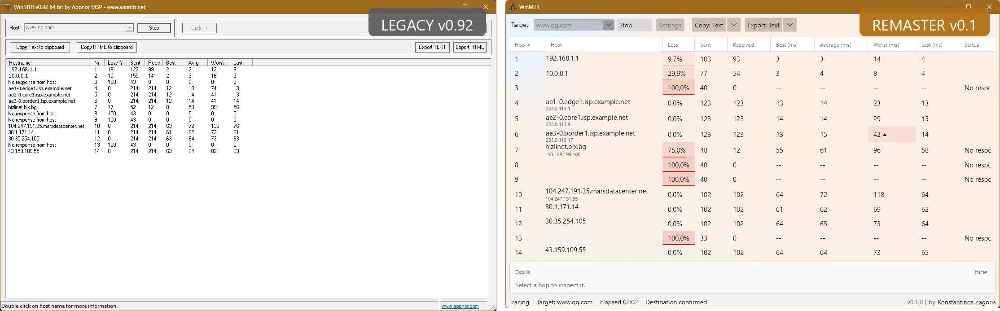
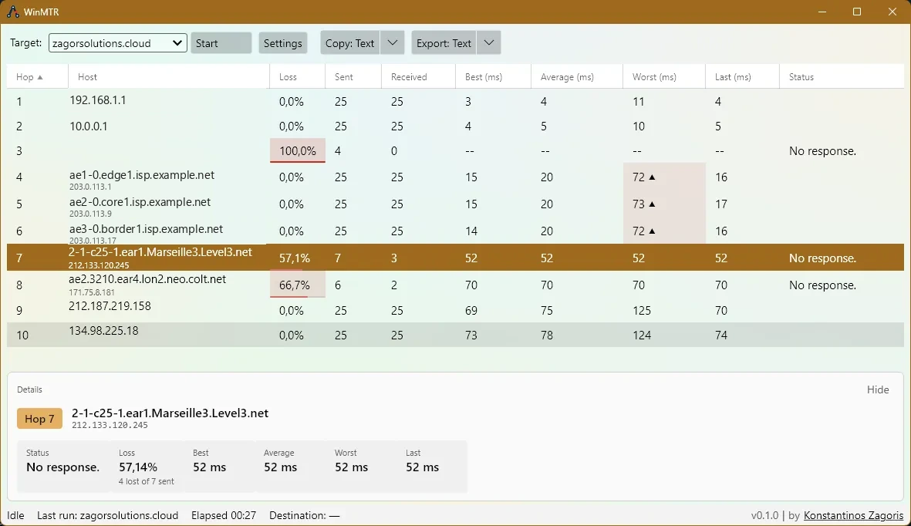
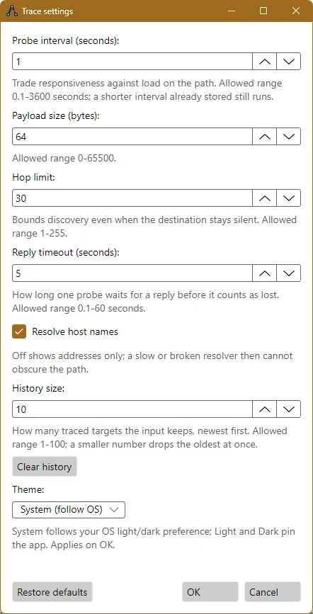
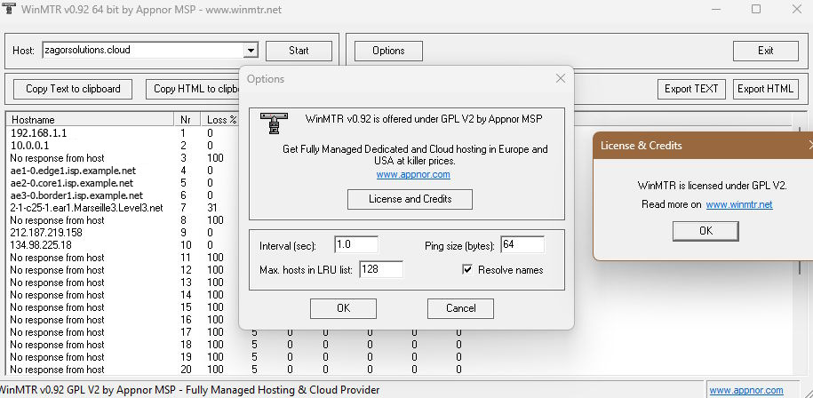
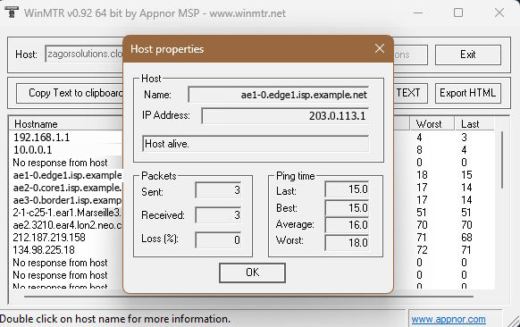

# WinMTR

> **Port Challenge entry.** WinMTR is an open-source entry in the
> [Avalonia Port Challenge](https://avaloniaui.net/blog/avalonia-port-challenge),
> the $15,000 prize pool funded by Devolutions.
>
> **Full write-up.** The migration account lives on my blog:
> [Porting WinMTR to Avalonia](https://www.wittyprogramming.dev/articles/porting-winmtr-to-avalonia/).



*The same window, fifteen years apart.*

WinMTR combines [traceroute](https://en.wikipedia.org/wiki/Traceroute) and
[ping](https://en.wikipedia.org/wiki/Ping_%28networking_utility%29) in one
window. It probes the path with an increasing TTL and keeps pinging every hop it
discovers, so a single window shows which hop loses packets. When someone says
the site is slow from the office, this is the first tool I open.

The original is an MFC application for Windows, and its last release, `v0.92`,
is dated 31 January 2011. The algorithm has aged well; the housing has not. The
dialogs are MFC, the settings live in `HKCU\Software\WinMTR`, and the program
runs on one platform.

This repository is a remaster of that tool on [Avalonia](https://avaloniaui.net/)
and .NET 10. One codebase now runs on Windows, macOS and Linux, the tracing
engine does not depend on the platform, and the route is published as immutable
snapshots for any front-end to consume.

## Installation

Each release is published by hand from the Actions tab. It builds a
self-contained archive of the desktop application and of the console for five
platforms: `win-x64`, `linux-x64`, `linux-arm64`,
`osx-x64` and `osx-arm64`. Download the one for your platform from the
[releases page](https://github.com/kzagoris/winmtr-remaster/releases), extract
it, and run `winmtr` for the window on Windows or Linux, or `winmtr-cli` for
the terminal on any platform. The binaries are Native AOT, so no .NET runtime
is needed.

On macOS 14 or later, choose `osx-arm64` for Apple Silicon or `osx-x64` for
Intel. Extract the desktop archive, drag **WinMTR.app** to **Applications**,
then double-click it in Finder. Keep the bundle intact: it contains the native
libraries as well as the executable. The console remains a plain archive.

The `osx-x64` archive is cross-compiled on Apple Silicon. No machine in the
release pipeline can run Intel code, so that archive is built and checked but
never started before publication. The other four platforms are started during
the release run.

On Linux and macOS, start it with elevated privileges if you want full hop
identification; the application shows a banner when a capability is missing.

The macOS desktop bundle is **ad-hoc signed**, not Developer ID signed or
notarized. This checks local integrity but does not establish publisher trust.
Gatekeeper may still block it: try right-clicking **WinMTR.app** and choosing
**Open**, then confirm the warning. If macOS still blocks a download you trust,
clear its quarantine flag once after moving the bundle to Applications:

```
xattr -dr com.apple.quarantine /Applications/WinMTR.app
```

For the plain macOS console download, use
`xattr -d com.apple.quarantine ./winmtr-cli` in its extracted directory instead.
Windows binaries are not publisher-signed. SmartScreen shows a warning; choose
**More info**, then **Run anyway**.

Building from source needs the [.NET 10 SDK](https://dotnet.microsoft.com/download):

```
git clone https://github.com/kzagoris/winmtr-remaster.git
cd winmtr-remaster
dotnet run --project src/WinMtr.Desktop
```

The Windows build has a Native AOT publish profile under
`src/WinMtr.Desktop/Properties/PublishProfiles`, so the desktop application can
ship without a runtime dependency. The release workflow does not use the
profile: it publishes every platform with one command shape. See
`docs/adr/0007-native-aot-release-matrix.md`.

## Routes, Errors and Reports

Three differences from `v0.92` are visible in the output.

**Routes grow, they are not padded.** `v0.92` always displayed `MAX_HOPS` rows
and filled the unreached ones with `No response.`, so a five-hop path looked
like a broken thirty-hop one. Snapshots now trim trailing silence to the last
responding hop. Underneath, the storage and the worker set are dynamic: a fast
start of eight TTLs, then three-TTL growth as evidence arrives.

**The error message stopped impersonating the hostname.** In `v0.92` a failed
probe writes its reason into the name column, so a transient condition destroys
the identity of the hop. We keep the address and the resolved name as identity,
store the reason separately, and replace the *latest probe state* on every
probe.

**Reports gained text and JSON.** `v0.92` exports HTML and CSV; both remain. The
fixed-width text report suits a support ticket, and JSON exposes the
measurements the legacy columns summarise. Because both legacy renderers
already emit a `Status` column that `v0.92` never had, output is not
byte-identical to the old tool.

## The Avalonia Front-End

For the look I stayed on the stock Fluent theme: two custom colour palettes, a
Mica backdrop on a plain window, and the platform UI font with the bundled
Inter face as the fallback. I tried
[FluentAvalonia](https://github.com/amwx/FluentAvalonia) first and dropped it
because its `AppWindow` broke the headless tests. The original was a plain
Windows dialog, so a native Windows 11 appearance is the honest continuation
of it, and the window follows the operating system light or dark preference.

For the MVVM layer I chose
[CommunityToolkit.Mvvm](https://learn.microsoft.com/en-us/dotnet/communitytoolkit/mvvm/)
over ReactiveUI. The source-generated `[ObservableProperty]` and `[RelayCommand]`
cost no Rx learning tax, and the project publishes with `IsAotCompatible=true`,
where ReactiveUI has historically been the weak spot for trimming.

Snapshots are immutable and arrive per cadence, so the naive option is to
rebuild the grid each time. Instead the grid keeps an
`ObservableCollection<HopRowViewModel>` keyed by hop index and reconciles it:
update in place, append new hops, retain rows that later snapshots trim.
Retention is a presentation rule only, so every exported report stays trimmed.



*The live hop grid, the selected-hop detail pane, and the status bar.*

One toolbar row holds the target input, the Start/Stop toggle, and the Settings
button. The input suggests targets from the history, newest first, and validates
the target as you type, so a typo is refused before the trace starts. A single
button reads Start when idle and Stop while running, and shows preparation as a
separate state, so the control never disagrees with what the application is
doing. Failures do not interrupt: a DNS failure or a capability-detection
timeout appears in the status bar or a dismissible banner, and the rows already
gathered stay on screen with copy and export still available.

The grid has one row per hop and a column for hop number, host, loss, sent,
received, best, average, worst, last and status, with full words in the headers.
Sorting is live and applies to every column, so sorting by loss keeps the
failing hop in view while the figures change; a third select on the header
returns the rows to hop order.

Loss and latency carry their severity inside the cell. A loss cell takes a tint
and a slim bar along its foot, and a latency outlier takes a tint and a `▲`
marker. Colour and glyph appear together, so the diagnosis survives a monochrome
print. The Host cell shows the resolved name with the address on a second line,
which lets you compare addresses without opening each hop.

Selecting a row opens the detail pane. It carries the latest probe state, the
accurate loss percentage with the raw counts behind it, and the best, average,
worst and last round-trip times. The pane collapses when the grid should have
the full height, and the grid scrolls horizontally on a narrow window rather
than clipping its last columns.

Copy and Export each offer every format the engine renders — text, HTML, CSV and
JSON — at any time, including while the trace runs, and the export filename
carries a UTC timestamp. The status bar carries the accepted target, the elapsed
session time, and whether the destination is confirmed; when no trace runs, it
says so and labels the numbers as the last run.

## Settings



*The Settings dialog, with the reply timeout, history size, and theme.*

Settings are modal, apply on confirmation, and are disabled while a trace runs,
because the session owns the settings it began with. Each field states the range
it accepts and the sentence that explains it.

| Setting            | Range               | Purpose                                                                                                                        |
| ------------------ | ------------------- | ------------------------------------------------------------------------------------------------------------------------------ |
| Probe interval     | 0.1–3600 s          | Trade responsiveness against load on the path. A shorter interval already stored still runs.                                   |
| Payload size       | 0–65500 bytes       | Test whether larger packets are treated differently. Disabled with an explanation when the platform restricts a custom payload. |
| Hop limit          | 1–255               | Bound discovery even when the destination stays silent.                                                                        |
| Reply timeout      | 0.1–60 s            | How long one probe waits for a reply before it counts as lost.                                                                 |
| Resolve host names | on or off           | Off shows addresses only, so a slow resolver cannot obscure the path.                                                           |
| History size       | 1–100               | How many traced targets the input keeps, newest first. A smaller number drops the oldest at once.                               |
| Theme              | System, Light, Dark | System follows the operating system preference. Applies on confirmation.                                                        |

Below the fields, **Restore defaults** returns every value in one action.
**Clear history** asks for confirmation inline: it shows `Will clear N targets.`
with an Undo, and the entries are removed only when you confirm. Nothing is
written while the dialog is open, so Cancel costs nothing.

Accepted settings and target history live in two JSON files, `settings.json` and
`history.json`, under a `WinMTR` folder that
`Environment.SpecialFolder.LocalApplicationData` resolves per platform. The two
files are separate because they are written at different moments, so a damaged
host list cannot cost you your probe settings. On Windows, the first run reads
the legacy `HKCU\Software\WinMTR` key once and adopts what `v0.92` left there; it
never writes back, so both versions can be installed side by side.

## The Legacy Window

The original is still worth reading as the specification for this remaster. It
drew thirty rows whether the route used five hops or thirty, kept its settings
in the registry, and showed one hop at a time in a separate dialog.



*The legacy Options dialog: interval, payload size, history size, name
resolution, and the GPL v2 notice.*



*The legacy Host properties dialog, which the selected-hop detail pane replaces.*

## Cross-Platform Notes

Cross-platform is where a port stops being a translation exercise, and I would
not present it as solved.

An unprivileged process on Linux or macOS cannot send a custom ICMP payload.
Initialization detects this, reports `PayloadSupport.Restricted`, and falls back
to the platform default. The failure mode is not a crash but a user concluding
the application is broken, so the capability check surfaces a one-line banner
that names the reason and the trace keeps running.

The intermediate-address behaviour on Unix is the part I still want measured on
real distributions before this README promises anything about it.

## The Command-Line Front-End

`WinMtr.Console` is not a demo. The engine is continuous and timing-dependent,
which is the combination that is least pleasant to debug through a UI, and a CLI
that prints a rendered snapshot per cadence turns "the grid looks wrong" into a
text diff.

```
dotnet run --project src/WinMtr.Console -- example.com --interval 1 --hop-limit 30
```

The arguments are the host, `--interval` in seconds, `--size` in bytes,
`--hop-limit` from 1 to 255, and `--numeric` to skip reverse DNS lookups.

## Projects

| Project                 | Role                                                                                                            |
| ----------------------- | --------------------------------------------------------------------------------------------------------------- |
| `WinMtr.Core`           | Platform-independent domain: hops, statistics, the trace engine, and the report renderers.                        |
| `WinMtr.Infrastructure` | The parts that touch the machine: ICMP probing through .NET networking and reverse-DNS resolution with caching.   |
| `WinMtr.Console`        | A command-line front-end that composes the core and the infrastructure. Ships as `winmtr-cli`.                    |
| `WinMtr.Desktop`       | The desktop application for Windows, macOS and Linux. Ships as `winmtr`.                                          |

## Documentation

`CONTEXT.md` holds the domain language — *responding hop*, *silent hop*,
*trailing silence*, *route snapshot* — and the words the project avoids. I
would start reading there; it is the artefact that makes the rest of the code
navigable.

## Development

The suite is fast and runs without network access:

```
dotnet test WinMtr.Remaster.sln
```

Integration tests that send real ICMP traffic are excluded by default, because
they fail on connectivity rather than on a defect in this code. Enable them with
`-p:VSTestTestCaseFilter="Category=Integration"`.

## License

WinMTR is offered under the GNU General Public License, version 2. The full text
is in [`LICENSE`](LICENSE).

The original WinMTR was maintained by Appnor MSP, and this remaster keeps the
same license. The remaster is maintained by Konstantinos Zagoris.
